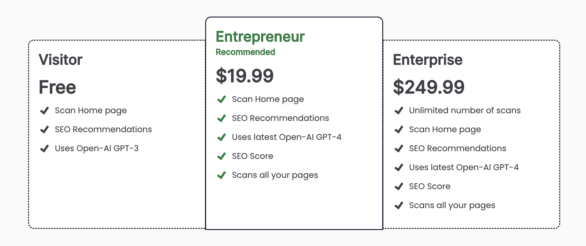

# Pricing Page

- (REMOVED) Configurable Price Page that enables 'recommended' pricing to standup by just passing in color and which is recommended



## Usage

- Simple usage

```js
<div className="banner banner-0 text-gray-50 bg-neutral-50">
  {error && <div className="bg-red-900"> ERROR: {error}</div>}
  <WelcomePage />
</div>
```

## Code

- PricingPage.js

```js
import { CheckIcon } from "../utils/checkicon";
export const Prices = ({ user }) => {
  const freeLink = user ? "/me" : "/api/auth/login?returnTo=/me?free=true";
  const paidLink = user ? "/pioneer" : "/api/auth/login?returnTo=/pioneer";

  const pricingData = [
    {
      plan: "Free Trial",
      previousPrice: "$10",
      price: "$0",
      recommended: false,
      perks: ["Enjoy up to 3 Channels", "Sync across Devices", "Personalized User Dashboard"],
    },
    {
      plan: "Pioneer Package",
      previousPrice: "$30",
      price: "$25",
      recommended: true,
      perks: [
        "Access to Unlimited Channels",
        "Sync Across Devices",
        "Personalized User Dashboard",
        "Guaranteed Price Lock-In",
      ],
    },
  ];

  return (
    <div className="min-h-[60vh] flex-wrap justify-center items-center flex pb-12">
      <div className="flex self-center justify-center align-center lg:w-[50vw] ">
        <div className="w-full grid min-h-[40vh] m-2 grid-cols-2 gap-4 ">
          {pricingData.map((plan, idx) => (
            <>
              <div
                key={idx}
                className={`relative w-full lg:col-span-1 col-span-2 w-full rounded-lg
                 shadow-2xl flex flex-col text-gray-200 
                 bg-gradient-to-t from-gray-900
                 via-gray-800 to-gray-900 z-0 p-8 ${plan.recommended && "border-4 border-rose-900"}`}
              >
                {plan.recommended && (
                  <div
                    className="absolute top-0 left-1/2 -translate-x-1/2 -translate-y-1/2 z-20 
                  bg-rose-700 rounded-lg font-bold px-4 py-0.5 text-amber-400"
                  >
                    Popular
                  </div>
                )}
                <p className="font-bold text-2xl  whitespace-nowrap">{plan.plan}</p>
                <div
                  className="flex flex-row items-center 
                lg:pt-8 pt-1 pr-10 gap-3"
                >
                  <div className="flex whitespace-nowrap inline-block ">
                    <span className="text-sm line-through flex items-end pr-2">{plan.previousPrice}</span>
                    <p className="text-5xl font-bold pr-2">{plan.price}</p>
                    <p className="text-md flex items-end font-regular text-gray-400">USD</p>
                  </div>
                </div>
                <div className="grid grid-cols-12 h-fit lg:gap-y-3 gap-y-1 lg:pt-10 pt-4">
                  {plan.perks.map((perk, index) => (
                    <>
                      <div>
                        <CheckIcon />
                      </div>
                      <div className="col-span-11 text-md flex items-center font-medium pl-2">{perk}</div>
                    </>
                  ))}
                </div>
                <div className="flex items-end justify-bottom align-bottom h-full">
                  <div className="w-full flex items-center justify-center align-center lg:mt-20 mt-4 mb-5 text-gray-100">
                    <a href={paidLink.price === "$0" ? freeLink : paidLink} className="block" aria-current="page">
                      <button className={`rounded px-12 hover:bg-rose-500 font-bold bg-rose-700 w-full py-3`}>
                        {plan.price === "$0" ? "Try for Free" : "Get Started Here"}
                      </button>
                    </a>
                  </div>
                </div>
                {plan.recommended && (
                  <div className="flex items-end justify-center align-center">
                    <p className="text-sm font-bold text-amber-400">Limited to the first 100 Customers</p>
                  </div>
                )}
              </div>
            </>
          ))}
        </div>
      </div>
    </div>
  );
};
```
