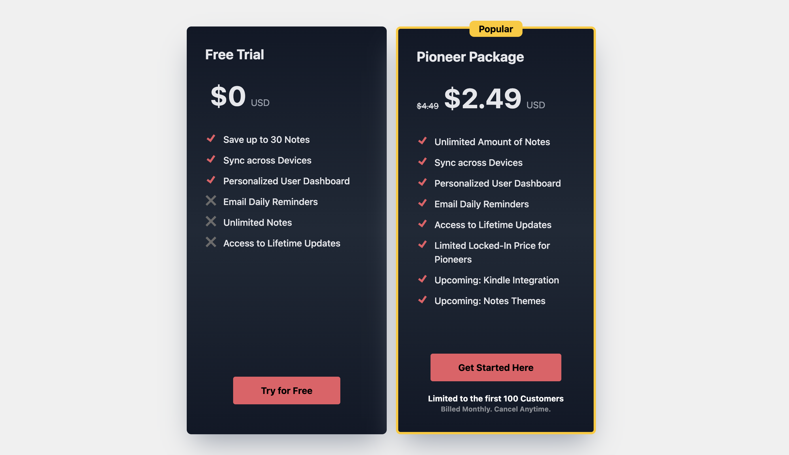

# Pricing Page

- Configurable Price Page that enables 'recommended' pricing to standup by just passing in color and which is recommended



## Usage

- Simple usage

```js
<div className="banner banner-0 text-gray-50 bg-neutral-50">
  {error && <div className="bg-red-900"> ERROR: {error}</div>}
  <WelcomePage />
</div>
```

## Code

- PricingPage.js

```js
import { CheckIcon } from "./CheckIcon";
export const PricePage = ({ pricingData, recommendedColor }) => {
  return (
    <>
      {pricingData.map((d, index) => {
        let edge = "";

        if (index === 0) {
          edge = "rounded-l-lg";
        } else if (index === pricingData.length - 1) {
          edge = "rounded-r-lg";
        }
        const recommendedDiv = d.recommended ? `h-full rounded-t-lg` : `mt-10`;
        const selectedColor = d.recommended ? `${recommendedColor}` : ``;
        const outline = !d.recommended ? `outline-dashed` : `outline`;
        return (
          <div
            key="1"
            className={`rounded-bg-white bg-white text-left ${edge} ${recommendedDiv} font-bold lg:col-span-1 xs:col-span-1 ${outline} outline-slate-900 flex flex-col m-[1px] p-4`}
          >
            <div className={`inter text-2xl pb-3 ${selectedColor}`}>
              {d.plan}
              {d.recommended && <div className="text-sm">Recommended</div>}
            </div>
            <div className="inter text-3xl font-black pb-3">{d.price}</div>
            <div className="fill-green-900">
              {d.perks.map((perk, index) => (
                <div key={index} className="flex font-thin pb-2 text-sm pb-3">
                  <div>
                    {" "}
                    <CheckIcon currentColor={selectedColor} />{" "}
                  </div>
                  &nbsp; {perk}
                </div>
              ))}
            </div>
          </div>
        );
      })}
    </>
  );
};
```

- CheckIcon

```js
export const CheckIcon = ({ currentColor }) => {
  return (
    <>
      <svg
        className={`w-5 h-5 ${currentColor}`}
        fill="currentColor"
        viewBox="-4 0 32 32"
        version="1.1"
        xmlns="http://www.w3.org/2000/svg"
      >
        <g id="SVGRepo_bgCarrier" stroke-width="0"></g>
        <g id="SVGRepo_tracerCarrier" stroke-linecap="round" stroke-linejoin="round"></g>
        <g id="SVGRepo_iconCarrier">
          {" "}
          <title>check</title> <path d="M19.375 5.063l-9.5 13.625-6.563-4.875-3.313 4.594 11.188 8.531 12.813-18.375z"></path>{" "}
        </g>
      </svg>
    </>
  );
};
```
